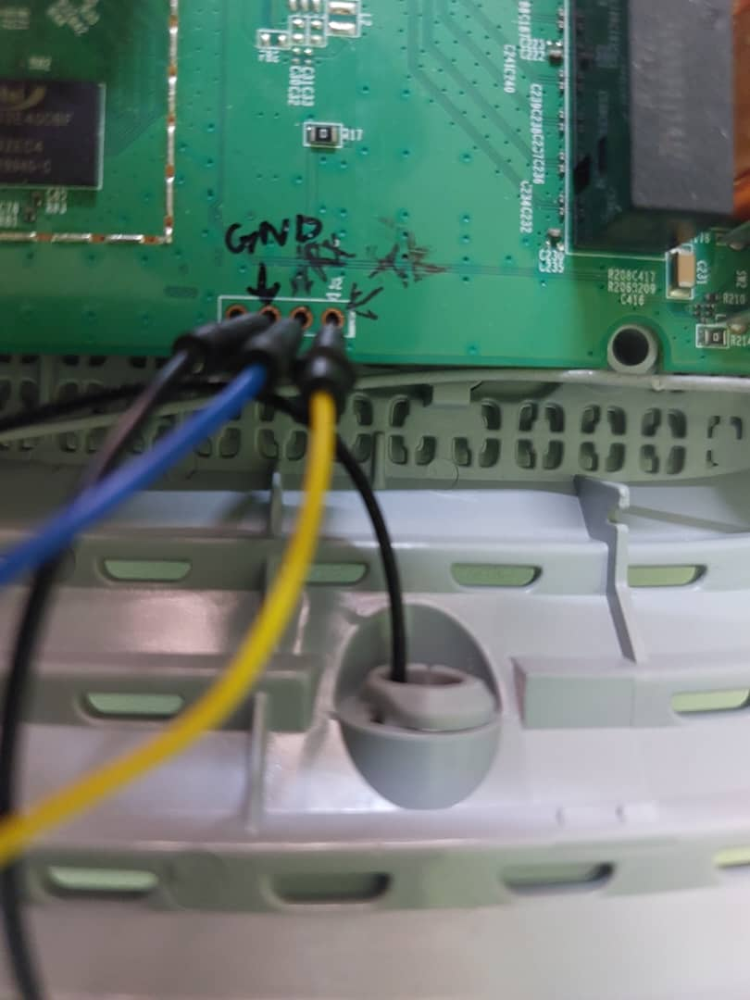
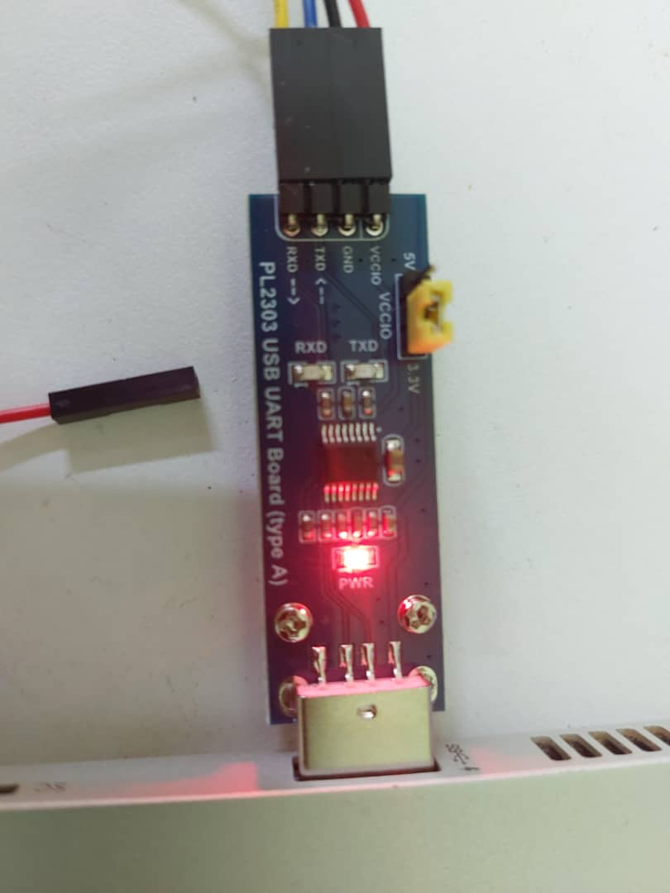

---
### Current issue
- The WiFi router provided by ISP ACT is locked, and it's not possible to change the firmware through the GUI management page.
- To install OpenWRT, physical access to the router is required.
- Open up the router casing carefully and locate a group of 4 unlabelled circular pads or pin headers — these are likely UART.
- Use a multimeter to identify the UART pins (GND, TX, RX, VCC).
---
### 1.  Steps to Identify Pins Using a Multimeter
1. **Set multimeter to continuity mode** (marked with a diode/beep symbol).
2. **Identify GND:**
   - Power on the router.
   - Place the black probe on a known ground point (e.g., metal shielding or an Ethernet port casing).
   - Tap the red probe on each of the 4 pins.
   - The pin that causes the multimeter to **beep** is **GND**.
3. **Identify TX:**
   - Set the multimeter to voltage mode.
   - With the router still powered, place the black probe on the GND pin.
   - Tap the red probe on the remaining pins.
   - The one that shows **fluctuating voltage** (e.g., bouncing between 0V–3.3V when the device is booting) is likely **TX** (transmitting data from the router).
4. **Identify RX:**
   - Still with the black probe on GND, check the remaining pins.
   - The **RX** pin usually stays at a steady **low voltage (~0V)**.
   - (Note: You won't see much fluctuation here unless you're sending data to the router.)

---

You can solder header pins onto the board or use jumper cables and attach them using a clip.

Use a UART to USB adapter to connect to your laptop. 

Note: **The TX of the adapter should connect to RX of the router and the RX of the adapter to TX of the router. GND to GND. (Cross connection).**






.jpeg>)

---

### 2. Using the terminal to access the router.

Use `minicom` , a CLI serial communication tool used to interact with serial ports such as UART.

Set the baud rate to `-b 115200` and check which port your USB is connected to. In this case it is connected to `/dev/ttyUSB0`.

Use the following command to connect:
`sudo minicom -D /dev/ttyUSB0 -b 115200
`
---

 Restart the router, you will see the router sending info to the terminal.
 After the router boots, a login and password prompt appear. If the login and password are know you can proceed. But we need to change the firmware.
 So,
 
Restart the router, and on boot, repeatedly press the `t` on your keyboard. This will interrupt the U-Boot autoboot countdown, and will prevent the router from loading it's normal firmware. Now you can see the U-Boot command-line shell.

Because autoboot was stopped, it did not load the Linux firmware.

---
### 3. Installing the OpenWRT binary

Check for the version of Archer C5 and download it's binary. Visit openWRT and follow the instructions:

![[openWRT.png]]

---
### 4. After installation

If your ssh client is new, it won't support the oldew `ssh-rsa` algorithm because it is disabled by default for security. However the router only offers `ssh-rsa`. So use the following command with the `-oHostKeyAlgorithms=+ssh-rsa` option. Replace the username and IP address if needed.

```bash
ssh -oHostKeyAlgorithms=+ssh-rsa root@192.168.2.1
```

You should see the following:

![[OpenWRT-CLI.png]]

---
